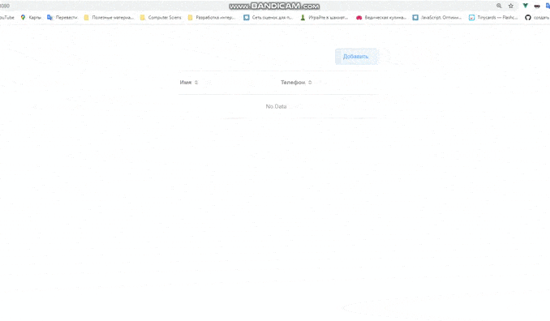

## Тестовое задание для компании RoiStat

С помощью формы добавляется пользователь, и присутствует возможность добавлять подчененных на несколько уровней. Через простое вычисляемое свойство список превращается в дерево благодаря чему можно просматривать подчиненных на несколько уровней. 
